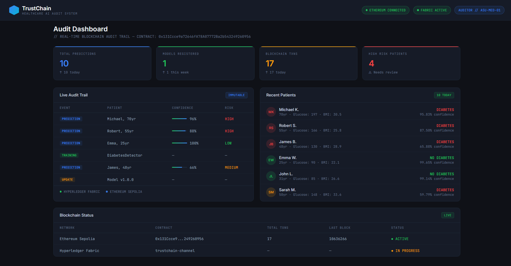

# TrustChain 🔗
### A Blockchain-Powered Auditing System for Transparent and Accountable Healthcare AI

> CSE 540: Engineering Blockchain Applications — Arizona State University, Spring B 2026

---

## Introduction

TrustChain is a hybrid blockchain-based auditing system that creates an **immutable, tamper-proof audit trail** for healthcare AI models.

The problem it solves is simple: hospitals use AI to diagnose patients, but nobody can verify how the AI made its decision, who modified it, or whether it was tampered with. When an AI makes a wrong diagnosis, there is no record — no accountability, no trace.

TrustChain fixes this by recording **every single AI event permanently on the blockchain** — every prediction, every training run, every model update, every access — making healthcare AI fully transparent and auditable.

The system pairs a **machine learning disease prediction model** with a **hybrid blockchain network** (Hyperledger Fabric + Ethereum) so that every AI decision gets cryptographically recorded and lives permanently on an immutable ledger. No tampering. No hiding. No excuses.

## 🖥️ Dashboard Preview


---

## How It Works

Here's the flow when the AI model makes a prediction:

1. A doctor enters patient data into the frontend dashboard
2. The **FastAPI backend** sends the data to the AI model
3. The AI model predicts the disease with a confidence score
4. The backend **hashes the input and output** (never raw patient data — HIPAA compliant)
5. The backend submits the prediction to **both blockchain layers simultaneously**:
   - **Hyperledger Fabric** records the full private details (hospitals/regulators only)
   - **Ethereum** records the public cryptographic proof (anyone can verify)
6. The prediction is now **permanently recorded** — impossible to delete or tamper with
7. Doctors, regulators, and auditors can query the **Auditor Dashboard** to see the full history

---

## Project Structure

```
TrustChain/
├── api/
│   └── app.py                        # Python FastAPI backend — connects AI to blockchain
├── contracts/
│   ├── ethereum/
│   │   └── TrustChainAudit.sol       # Ethereum public audit trail (Solidity)
│   └── fabric/
│       └── trustchain.go             # Hyperledger Fabric chaincode (Golang)
├── frontend/
│   └── dashboard.html                # Auditor Dashboard UI
├── ml/
│   └── model.py                      # Healthcare AI disease prediction model (Python)
├── docs/
│   └── architecture.md               # Full system architecture
└── requirements.txt                  # Python dependencies
```

---

## The Blockchain Network

TrustChain runs a **hybrid two-blockchain architecture**:

### Private Layer — Hyperledger Fabric

| Organization | MSP ID | Role |
|---|---|---|
| HospitalOrg | HospitalOrgMSP | Hospitals that run the AI model |
| RegulatorOrg | RegulatorOrgMSP | Government health regulators |
| AuditorOrg | AuditorOrgMSP | Independent auditors |

**Endorsement Policy:**
```
AND('HospitalOrgMSP.peer', 'RegulatorOrgMSP.peer')
```
Both a hospital peer AND a regulator peer must sign off on every transaction before it gets committed to the ledger.

All organizations share a single channel called `trustchain-channel`.

### Public Layer — Ethereum

- Immutable public record of all AI audit events
- Anyone in the world can verify the audit trail
- No single organization controls it
- Cryptographic proof that the private Fabric chain was not tampered with

---

## The Smart Contracts

### Hyperledger Fabric Chaincode (`contracts/fabric/trustchain.go`)

Written in Go using the `fabric-contract-api-go` SDK.

| Function | What it does |
|---|---|
| `RegisterModel` | Registers a new AI model on the private ledger |
| `LogModelEvent` | Records training events (data ingestion, config changes) |
| `LogPrediction` | Records every AI diagnosis — input hash, output hash, confidence |
| `LogModelUpdate` | Records when the AI model is retrained or updated |
| `QueryAuditTrail` | Returns full audit history for a model |
| `RevokeAccess` | Removes an actor's permission to use the model |

**World State Storage:**

| Key Pattern | What's Stored |
|---|---|
| `MODEL_<modelID>` | `{modelName, version, owner, createdAt, isActive}` |
| `EVENT_<modelID>_<txID>` | `{eventType, timestamp, actorID, dataHash}` |

### Ethereum Smart Contract (`contracts/ethereum/TrustChainAudit.sol`)

Written in Solidity `^0.8.20`.

| Function | What it does |
|---|---|
| `registerModel()` | Registers AI model on public chain |
| `logModelEvent()` | Records training events publicly |
| `logPrediction()` | Records prediction proof publicly |
| `logModelUpdate()` | Records model version changes |
| `revokeAccess()` | Revokes actor access |
| `queryAuditTrail()` | Returns public audit history |

**Events emitted on-chain:**
- `AuditLogged` — fired on every audit event
- `ModelRegistered` — fired when a new model is registered
- `AccessRevoked` — fired when access is removed
- `ModelUpdated` — fired when model version changes

---

## The AI Model

The ML layer uses a **disease prediction classifier** trained on real healthcare datasets.

Before any prediction hits the blockchain, the API:
1. Receives patient features (age, blood sugar, BMI, etc.)
2. Runs the prediction model
3. Gets a diagnosis + confidence score (0–100%)
4. **Hashes the input and output** (SHA-256) — never stores raw patient data
5. Sends the hashes to both blockchains

This ensures **HIPAA compliance** — patient data is never stored on-chain, only cryptographic proof.

---

## API Endpoints

| Method | Endpoint | What it does |
|---|---|---|
| `GET` | `/` | Health check |
| `POST` | `/model/register` | Registers a new AI model on both chains |
| `POST` | `/prediction/log` | Logs AI prediction on both chains |
| `POST` | `/event/log` | Logs training/access events |
| `POST` | `/model/update` | Logs model version update |
| `GET` | `/audit/{modelID}` | Returns full audit trail from Fabric |
| `DELETE` | `/model/revoke` | Revokes actor access on both chains |

---

## Dependencies & Setup

### Prerequisites

- Python 3.11+
- Go 1.21+
- Node.js 18+
- Docker & Docker Compose
- Hyperledger Fabric v2.5 binaries
- MetaMask (for Ethereum testing)

### Install Python Dependencies

```bash
pip install -r requirements.txt
```

### Install Hyperledger Fabric Binaries

```bash
curl -sSL https://bit.ly/2ysbOFE | bash -s
```

### Install Ethereum Dev Tools

```bash
npm install --save-dev hardhat @nomicfoundation/hardhat-toolbox
```

---

## How to Deploy

> ⚠️ Full deployment in progress. This is a high-level guide.

### 1. Start the Fabric Network

```bash
cd network
./scripts/start_network.sh
./scripts/deploy_chaincode.sh
```

This generates crypto material, spins up Docker containers (orderer, peers), creates `trustchain-channel`, joins all peers, and deploys the chaincode.

### 2. Deploy Ethereum Smart Contract

```bash
cd contracts/ethereum
npx hardhat compile
npx hardhat run scripts/deploy.js --network localhost
```

### 3. Start the Backend API

```bash
pip install -r requirements.txt
uvicorn api.app:app --reload --port 8000
```

API docs available at: `http://localhost:8000/docs`

### 4. Open the Dashboard

Open `frontend/dashboard.html` in your browser and connect to the API at `http://localhost:8000`.

### Tear Down

```bash
cd network
docker-compose down -v
```

---

## Environment Variables

| Variable | Default | What it controls |
|---|---|---|
| `FABRIC_PEER_ENDPOINT` | `localhost:7051` | gRPC endpoint for Fabric peer |
| `FABRIC_CRYPTO_PATH` | `network/crypto-config/...` | Path to MSP crypto material |
| `ETH_RPC_URL` | `http://localhost:8545` | Ethereum RPC endpoint |
| `CONTRACT_ADDRESS` | — | Deployed Ethereum contract address |
| `PORT` | `8000` | FastAPI server port |

---

## Usage Examples

### Register a new AI model
```bash
curl -X POST http://localhost:8000/model/register \
  -H "Content-Type: application/json" \
  -d '{
    "modelID": "diabetes-v1",
    "modelName": "DiabetesDetector",
    "version": "1.0.0",
    "owner": "hospital-org-1"
  }'
```

### Log an AI prediction
```bash
curl -X POST http://localhost:8000/prediction/log \
  -H "Content-Type: application/json" \
  -d '{
    "modelID": "diabetes-v1",
    "inputHash": "0xabc123...",
    "outputHash": "0xdef456...",
    "confidence": 87
  }'
```

### Query the full audit trail
```bash
curl http://localhost:8000/audit/diabetes-v1
```
Returns every event recorded for this model — predictions, training runs, updates, access — with timestamps and transaction hashes.

### Revoke access
```bash
curl -X DELETE http://localhost:8000/model/revoke \
  -H "Content-Type: application/json" \
  -d '{
    "modelID": "diabetes-v1",
    "actorID": "hospital-org-2"
  }'
```

---

## Production Considerations

- **TLS** — Local setup uses self-signed certs. In production, use Hyperledger Fabric CA for proper certificates.
- **Multiple Orderers** — We run a single Raft node locally. Production should have 3 or 5 orderers across different hosts.
- **Separate Hosts** — Each org's peer and CA should run on its own infrastructure.
- **API Authentication** — Add JWT middleware before exposing the backend publicly.
- **HIPAA Compliance** — Raw patient data is never stored on-chain. Only SHA-256 hashes are recorded.
- **Model Retraining** — Re-run `ml/model.py` training script after updating the dataset.
- **Monitoring** — Add Prometheus metrics and use Fabric's built-in operations endpoints for peer health.

---

## Team Members

| Name | ASU ID | Role |
|---|---|---|
| Navin Balaji Elangchezhiyan | 1237671918 | Blockchain Developer (Ethereum / Solidity) |
| Harish Anand | 1237366951 | AI/ML Engineer (Healthcare AI Model) |
| Mohit Badiyan | 1226119234 | Backend / Integration Engineer (FastAPI) |
| Vishal Sasikumar | 1237693862 | Frontend & Hyperledger Developer |
| Deepak Raj Vinoj Rajishree | 1237568243 | Security & Testing Engineer |

---

## License
MIT License — for academic use, CSE 540, Arizona State University.
