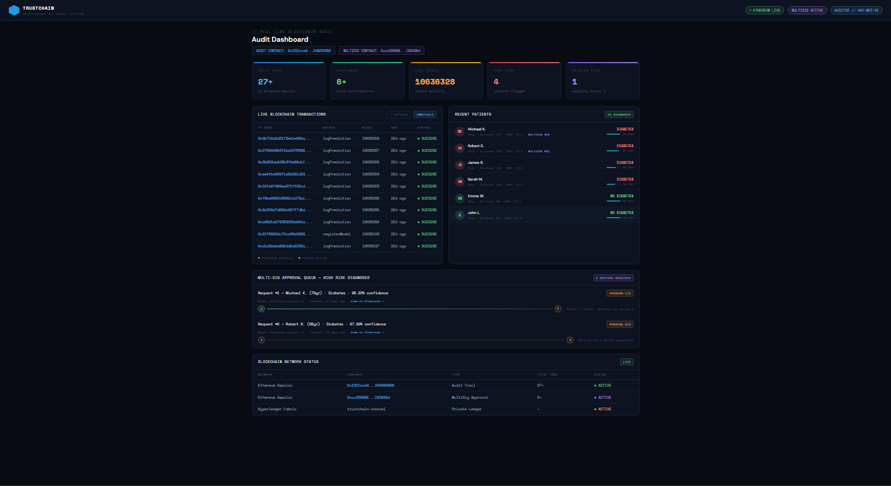

# TrustChain ⛓️🏥

> *"Every AI decision. Permanently recorded. Cryptographically proven. Forever accountable."*

**CSE 540 — Engineering Blockchain Applications | Arizona State University | Spring B 2026**  
**Group 14** | [Live on Ethereum Sepolia](https://sepolia.etherscan.io/address/0x131Ccce9a72646fA78A07772Ba2b543249260956)

---

## Problem Statement

Hospitals are increasingly deploying AI systems to assist in patient diagnosis. However, a critical accountability gap exists: when an AI model makes an incorrect or biased diagnosis, there is no verifiable record of what data the model used, who last modified it, or what reasoning led to its decision.

This represents a fundamental failure of transparency in healthcare AI:

- Patient data may be manipulated before inference
- Model weights may be altered without audit records  
- Confidence scores may be misrepresented to patients
- No mechanism exists for regulators to verify AI behavior

**TrustChain addresses this gap** by creating an immutable, cryptographically verifiable audit trail for every healthcare AI decision using a hybrid blockchain architecture.

---

## Core Contributions

TrustChain introduces three novel contributions to healthcare AI governance:

**1. Blockchain-Backed AI Auditability**  
Every AI prediction is cryptographically hashed (input, output, and SHAP explanation) and permanently recorded on Ethereum. No prediction can be altered retroactively.

**2. Multi-Signature Medical Validation System**  
High-risk diagnoses (confidence ≥ 75%) require independent approval from two authorized doctors before finalization on-chain. To our knowledge, no prior coursework integrates multi-signature human oversight directly into the AI prediction pipeline.

**3. Hybrid Private-Public Blockchain Architecture**  
Hyperledger Fabric handles private clinical data accessible only to authorized hospitals and regulators, while Ethereum provides a public cryptographic proof that anyone can independently verify — ensuring both privacy and transparency simultaneously.

---

## Live Deployments

| Contract | Address | Transactions |
|---|---|---|
| TrustChainAudit | [`0x131Ccce9...249260956`](https://sepolia.etherscan.io/address/0x131Ccce9a72646fA78A07772Ba2b543249260956) | 27+ confirmed |
| TrustChainMultiSig | [`0xcc33595E...CB3495d`](https://sepolia.etherscan.io/address/0xcc33595E34914898bE58a86Ae7BEe20EACB3495d) | 5+ confirmed |

---

## Dashboard Preview



*Live auditor dashboard displaying real Ethereum transactions, patient diagnoses, and multi-signature approval queue.*

---

## System Architecture

```
┌──────────────────────────────────────────────────────────────┐
│                      TRUSTCHAIN SYSTEM                        │
├──────────────────────────────────────────────────────────────┤
│                                                               │
│   [Doctor/Hospital] ──→ [Dashboard] ──→ [FastAPI Backend]    │
│                                               │               │
│                                   ┌───────────▼──────────┐   │
│                                   │     AI Model          │   │
│                                   │   XGBoost + SHAP      │   │
│                                   │   76.62% accuracy     │   │
│                                   │   81.89% ROC-AUC      │   │
│                                   └───────────┬──────────┘   │
│                                               │               │
│                               ┌───────────────▼────────────┐ │
│                               │       Hash Generator        │ │
│                               │  input_hash + output_hash   │ │
│                               │  + explanation_hash (SHAP)  │ │
│                               └──────┬────────────┬─────────┘ │
│                                      │            │           │
│                         ┌────────────▼──┐  ┌──────▼────────┐ │
│                         │  Hyperledger  │  │   Ethereum    │ │
│                         │  Fabric       │  │   Sepolia     │ │
│                         │  (Private)    │  │   (Public)    │ │
│                         │  Hospital +   │  │  TrustChain   │ │
│                         │  Regulator    │  │  + MultiSig   │ │
│                         └───────────────┘  └───────────────┘ │
│                                                               │
│   HIGH RISK (≥75%) ──→ TrustChainMultiSig ──→ 2 Doctor Sigs  │
└──────────────────────────────────────────────────────────────┘
```

---

## Repository Structure

```
TrustChain/
│
├── contracts/
│   ├── ethereum/
│   │   ├── TrustChainAudit.sol        # Public audit trail (events, RBAC, validation)
│   │   └── TrustChainMultiSig.sol     # Multi-sig approval for HIGH RISK diagnoses
│   └── fabric/
│       └── trustchain.go              # Hyperledger Fabric chaincode (Go)
│
├── ml/
│   ├── model.py                       # XGBoost + SHAP prediction model
│   ├── diabetes.csv                   # Pima Indians dataset (768 patients)
│   └── plots/shap_importance.png      # SHAP feature importance visualization
│
├── api/
│   ├── app.py                         # FastAPI backend
│   └── test_api.py                    # 24 API endpoint tests
│
├── test/
│   ├── TrustChain.test.js             # 29 Hardhat tests for TrustChainAudit
│   └── TrustChainMultiSig.test.js     # 22 Hardhat tests for MultiSig
│
├── scripts/
│   ├── deploy.js                      # Deploy TrustChainAudit
│   └── deployMultiSig.js              # Deploy TrustChainMultiSig
│
├── frontend/
│   └── dashboard.html                 # Live auditor dashboard
│
├── trustchain_demo.py                 # End-to-end demo: 10 patients → blockchain
└── .env.example                       # Environment variable template
```

---

## Smart Contracts

### TrustChainAudit.sol
Ethereum public audit trail. Deployed and live on Sepolia.

| Function | Access Control | Description |
|---|---|---|
| `registerModel()` | `onlyOwner` | Register a new AI model on-chain |
| `logPrediction()` | `onlyAuthorized` | Record input hash + output hash + confidence |
| `logModelEvent()` | `onlyAuthorized` | Record training and access events |
| `logModelUpdate()` | `onlyAuthorized` | Record model version updates |
| `grantAccess()` | `onlyOwner` | Authorize a hospital or actor |
| `revokeAccess()` | `onlyOwner` | Revoke an actor's access |
| `queryAuditTrail()` | Public | Read full audit history for a model |

**Security:** `onlyOwner`, `onlyAuthorized`, `modelExists` modifiers. Input validation on all functions. Structured revert messages throughout.

### TrustChainMultiSig.sol
Novel multi-signature approval system for high-risk diagnoses.

| Function | Access Control | Description |
|---|---|---|
| `requestApproval()` | Any | Submit HIGH RISK diagnosis (confidence ≥ 75%) |
| `signDiagnosis()` | Authorized Doctors | Approve or reject a pending diagnosis |
| `authorizeDoctor()` | `onlyOwner` | Grant doctor signing privileges |
| `getPendingRequests()` | Public | View all pending approval requests |
| `getPatientHistory()` | Public | View approval history for a patient hash |

Auto-finalizes when 2 independent signatures are collected. Auto-rejects if any authorized doctor votes against.

---

## AI Model

| Property | Value |
|---|---|
| Algorithm | XGBoost with SHAP explainability |
| Dataset | Pima Indians Diabetes (768 patients) |
| Accuracy | 76.62% |
| ROC-AUC | 81.89% |
| Validation | 10-fold cross validation |
| HIPAA | Only SHA-256 hashes stored on-chain |

**Engineered features:** `Glucose_BMI`, `Insulin_Resistance`, `Age_Risk`, `Metabolic_Score`

**Three hashes per prediction:**
1. `input_hash` — cryptographic proof of patient data received
2. `output_hash` — cryptographic proof of diagnosis result
3. `explanation_hash` — cryptographic proof of SHAP reasoning

---

## Test Coverage

```
npx hardhat test

  TrustChainAudit     29 tests passing ✅
  TrustChainMultiSig  22 tests passing ✅
  ─────────────────────────────────────
  Smart contract total: 51 passing

python -m pytest api/test_api.py -v

  API endpoints       24 tests passing ✅
  ─────────────────────────────────────
  API total: 24 passing

  Grand total: 75 tests passing ✅
```

**Coverage includes:** model registration, access control, prediction logging, confidence validation, multi-sig approval flow, doctor authorization, rejection handling, edge cases (duplicate signatures, unauthorized access, non-existent models), and API input validation.

---

## Tamper Resistance Demonstration

TrustChain is designed to detect and prevent tampering at every layer:

| Attack Vector | TrustChain Defense |
|---|---|
| Modify stored prediction | Ethereum is immutable — stored data cannot be changed |
| Replay old prediction | Each prediction has unique input+output hash combination |
| Unauthorized model update | `onlyOwner` modifier — only contract owner can register models |
| Single doctor override | MultiSig requires 2 independent doctor approvals |
| Delete audit record | Blockchain state is append-only — records cannot be deleted |
| Access patient data | Only hashes stored on-chain — raw data never leaves hospital |

---

## Stakeholder Roles

| Stakeholder | Blockchain Layer | Permissions |
|---|---|---|
| Hospital | Fabric + Ethereum | Submit predictions, log events |
| Regulator | Fabric + Ethereum | Read full audit trail |
| Auditor | Ethereum | Query public audit records via dashboard |
| Doctor | Ethereum MultiSig | Sign/reject high-risk diagnoses |
| Patient | Ethereum (public) | Verify their diagnosis independently on Etherscan |

---

## Quick Start

### Prerequisites
- Python 3.11+, Node.js 18+, Go 1.21+, Docker

### Setup
```bash
# Install dependencies
npm install
pip install -r requirements.txt

# Configure environment
cp .env.example .env
# Edit .env and add your PRIVATE_KEY

# Compile contracts
npx hardhat compile

# Run all tests (75 total)
npx hardhat test
python -m pytest api/test_api.py -v

# Deploy to Sepolia
npx hardhat run scripts/deploy.js --network sepolia
npx hardhat run scripts/deployMultiSig.js --network sepolia

# Run end-to-end demo
python trustchain_demo.py

# Open dashboard
open frontend/dashboard.html
```

---

## API Reference

| Method | Endpoint | Description |
|---|---|---|
| GET | `/` | Health check + blockchain connection status |
| GET | `/health` | Detailed system health |
| GET | `/stats` | Total event count from Ethereum |
| GET | `/audit/{modelID}` | Full audit trail for a model |
| POST | `/model/register` | Register AI model on blockchain |
| POST | `/prediction/log` | Log AI prediction (HIPAA compliant) |
| POST | `/event/log` | Log training or access event |
| POST | `/model/update` | Log model version update |
| DELETE | `/access/revoke` | Revoke actor access |

---

## Team — Group 14

| Name | ASU ID | Role |
|---|---|---|
| Navin Balaji Elangchezhiyan | 1237671918 | Blockchain Developer (Ethereum / Solidity) |
| Harish Anand | 1237366951 | AI/ML Engineer (Healthcare AI Model) |
| Mohit Badiyan | 1226119234 | Backend / Integration Engineer (FastAPI) |
| Vishal Sasikumar | 1237693862 | Frontend & Hyperledger Developer |
| Deepak Raj Vinoj Rajishree | 1237568243 | Security & Testing Engineer |

---

## License

MIT License — Academic use, CSE 540, Arizona State University, Spring B 2026.

---

*TrustChain — A verifiable medical AI governance system with cryptographic audit trail and human oversight layer.*
